# 📘 WORKTRAX — Guide Utilisateur Complet

**OPTINET SARLU • Système intégré de gestion des ouvriers multisites**

---

## 📋 Table des matières

1. [Présentation](#1-présentation)
2. [Connexion à l'application](#2-connexion-à-lapplication)
3. [Les 5 rôles utilisateurs](#3-les-5-rôles-utilisateurs)
4. [Tableau de bord Administrateur](#4-tableau-de-bord-administrateur)
5. [Module Ouvriers](#5-module-ouvriers)
6. [Enrôlement biométrique d'un ouvrier](#6-enrôlement-biométrique-dun-ouvrier)
7. [Module Engins (Camions / Machines / Carburant)](#7-module-engins)
8. [Pointage biométrique automatique](#8-pointage-biométrique-automatique)
9. [Terminal Pompiste](#9-terminal-pompiste)
10. [Espace RH (Absences, Paie)](#10-espace-rh)
11. [Espace Superviseur](#11-espace-superviseur)
12. [Caméras IP](#12-caméras-ip)
13. [Rapports & Statistiques](#13-rapports--statistiques)
14. [Gestion des utilisateurs](#14-gestion-des-utilisateurs)
15. [Sécurité et conformité](#15-sécurité-et-conformité)
16. [FAQ & Dépannage](#16-faq--dépannage)

---

## 1. Présentation

**WORKTRAX** est une plateforme web sécurisée développée pour **OPTINET SARLU** (Togo) afin de digitaliser la gestion des chantiers multisites :

- ✅ **30+ ouvriers** répartis sur 5 chantiers (Lomé-Agoè, Kégué, Baguida, Adéwui, Tsévié)
- ✅ **28 engins** (12 camions + 16 machines)
- ✅ **Pointage biométrique automatique** (empreinte + reconnaissance faciale)
- ✅ **5 rôles** avec accès contrôlé (RBAC)
- ✅ **Caméras IP** intégrées au tableau de bord
- ✅ Rapports, paie, absences, distribution de carburant

> 💡 L'application est entièrement en français et accessible depuis n'importe quel navigateur (PC, tablette, mobile).

---

## 2. Connexion à l'application

### Écran de connexion

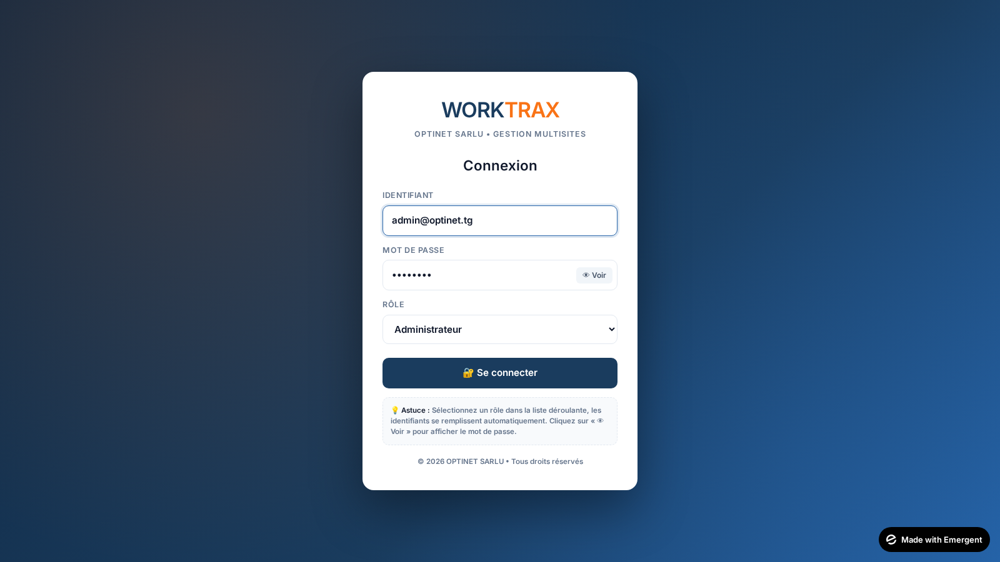

**Étapes :**

1. Saisir l'**identifiant** (email)
2. Saisir le **mot de passe**
3. Sélectionner votre **rôle** dans la liste déroulante (les identifiants se remplissent automatiquement pour les comptes de démo)
4. Cliquer sur 🔐 **Se connecter**

> 💡 **Astuce** : Cliquez sur le bouton **👁 Voir** pour afficher temporairement votre mot de passe et vérifier qu'il est correct.

### Comptes de démonstration

| Rôle | Identifiant | Mot de passe |
|------|-------------|--------------|
| 🛡️ Administrateur | admin@optinet.tg | admin123 |
| 👷‍♂️ Superviseur | superviseur@optinet.tg | super123 |
| 🧑‍💼 RH | rh@optinet.tg | rh123 |
| 📱 Contrôleur | controleur@optinet.tg | ctrl123 |
| ⛽ Pompiste | pompiste@optinet.tg | pomp123 |

---

## 3. Les 5 rôles utilisateurs

Chaque rôle donne accès à des fonctions précises :

| Rôle | Accès principal | Pages autorisées |
|------|-----------------|-----------------|
| **Administrateur** | Tout le système | Toutes |
| **Superviseur** | Son chantier | Ouvriers, Engins, Pointage, Caméras |
| **RH** | Personnel & paie | Ouvriers, Absences, Paie |
| **Contrôleur** | Pointage terrain | Terminal pointage, Journal du jour |
| **Pompiste** | Distribution gazole | Terminal carburant, Rapport conso. |

> 🔒 Si vous essayez d'accéder à une page non autorisée, un écran « Accès refusé » s'affiche avec un bouton de retour à votre espace.

---

## 4. Tableau de bord Administrateur

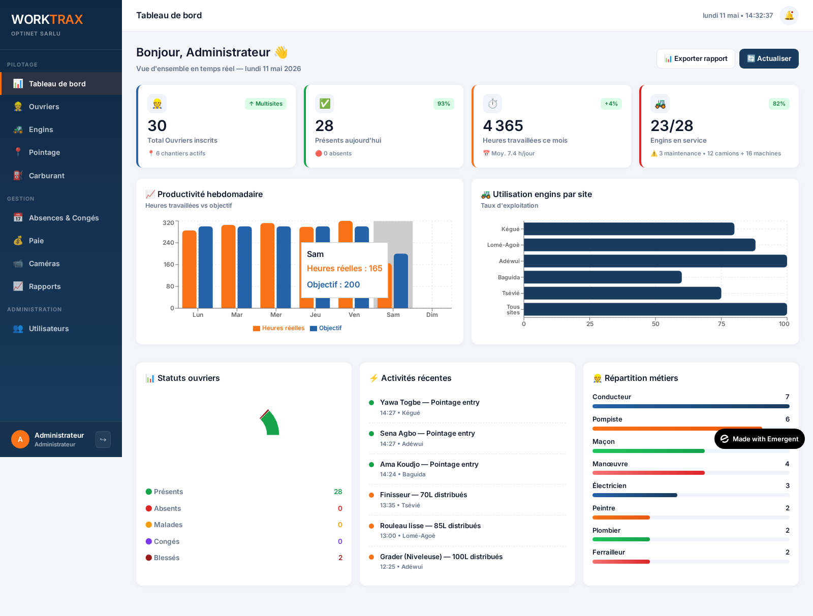

Le tableau de bord administrateur affiche :

### KPI en temps réel (en haut)
- 👷 **Total ouvriers inscrits** + nombre de chantiers actifs
- ✅ **Présents aujourd'hui** + taux de présence en %
- ⏱️ **Heures travaillées ce mois** + moyenne/jour
- 🚜 **Engins en service** + maintenance + total camions + machines

### Graphiques
- 📈 **Productivité hebdomadaire** : heures réelles vs objectif (par jour de la semaine)
- 🚜 **Utilisation engins par site** : taux d'exploitation par chantier
- 📊 **Statuts ouvriers** : graphique en donut (Présents / Absents / Malades / Congés / Blessés)
- 👷 **Répartition métiers** : nombre d'ouvriers par catégorie (Conducteur, Maçon, Manœuvre, etc.)
- ⚡ **Activités récentes** : derniers pointages et distributions carburant

### Actions rapides
- 📊 **Exporter rapport** (CSV/PDF)
- 🔄 **Actualiser** les données

---

## 5. Module Ouvriers

### Liste des ouvriers

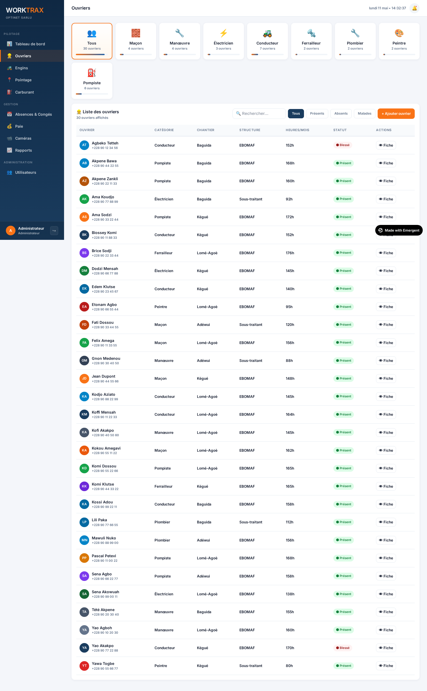

**Fonctionnalités :**

- 8 **cartes de catégories** en haut (Maçons, Manœuvres, Électriciens, Conducteurs, Ferrailleurs, Plombiers, Peintres, Pompistes)
- 🔍 **Barre de recherche** par nom
- **Filtres rapides** : Tous / Présents / Absents / Malades
- Tableau avec : avatar, nom, téléphone, catégorie, chantier, structure, heures/mois, statut, fiche détaillée

### Filtrage par catégorie

Cliquez sur une carte de catégorie (ex: **Maçon**) pour ne voir que ces ouvriers :

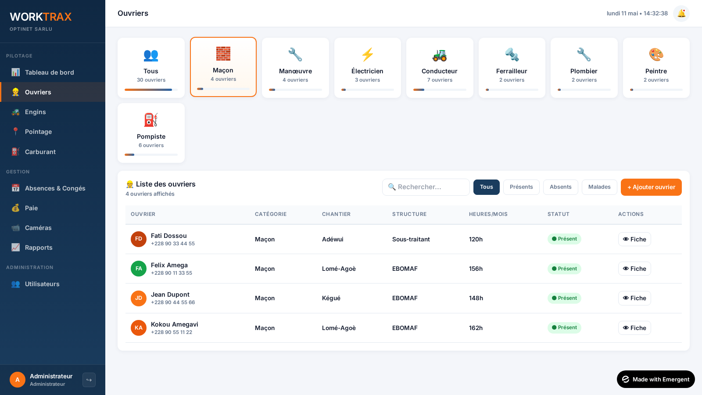

### Statuts ouvriers

| Badge | Signification |
|-------|---------------|
| 🟢 Présent | A pointé en entrée aujourd'hui |
| 🔴 Absent | Absence injustifiée |
| 🟡 Malade | Arrêt maladie en cours |
| 🟣 Congé | Congé payé en cours |
| ❤️ Blessé | Accident du travail |

---

## 6. Enrôlement biométrique d'un ouvrier

> ⚠️ Réservé aux rôles **Administrateur** et **Superviseur**.

L'enrôlement se fait en **3 étapes** via le bouton **+ Ajouter ouvrier**.

### Étape 1 — Informations personnelles

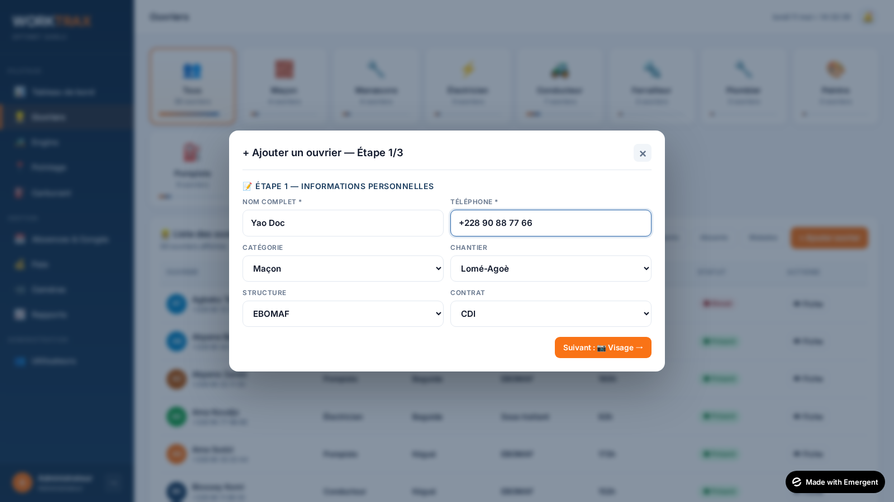

Renseignez : nom complet, téléphone, catégorie métier, chantier d'affectation, structure (EBOMAF / Sous-traitant), type de contrat (CDI/CDD/Journalier/Intérim).

### Étape 2 — Enrôlement reconnaissance faciale

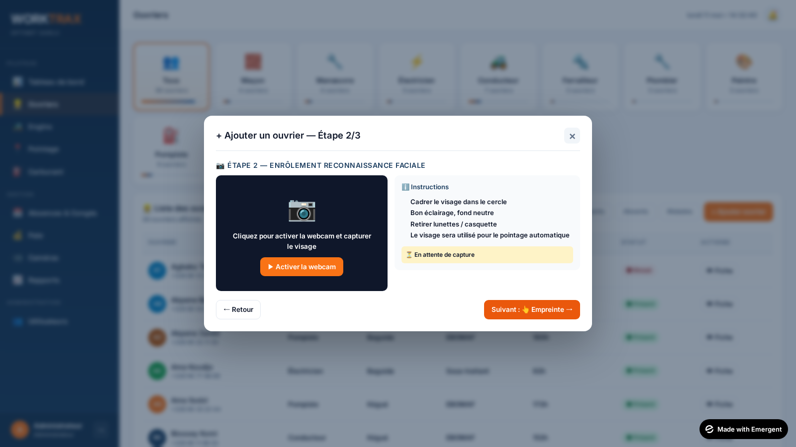

1. Cliquez **▶ Activer la webcam**
2. Cadrez le visage de l'ouvrier dans le cercle
3. Cliquez **📸 Capturer le visage**
4. Le visage capturé apparaît avec un badge ✅ **Capturé**
5. (Possibilité de **🔄 Reprendre** si la photo n'est pas nette)

> 💡 Bon éclairage, fond neutre, retirer lunettes/casquette.

### Étape 3 — Enrôlement empreinte digitale

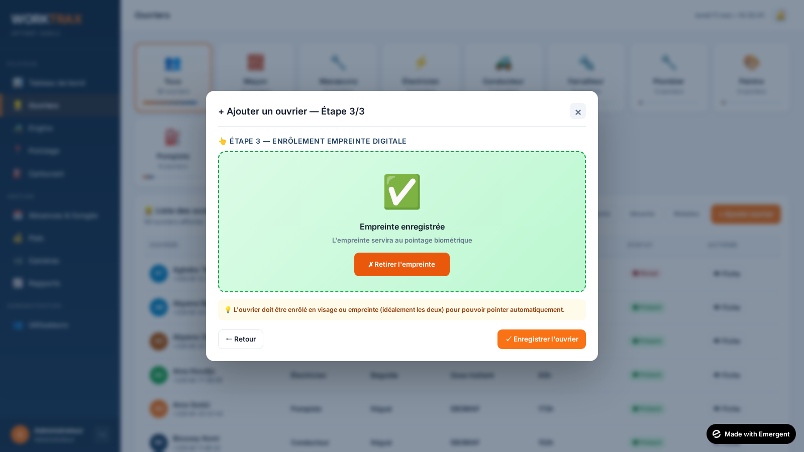

1. Cliquez **▶ Simuler l'enrôlement** (en production, l'ouvrier pose son pouce sur le lecteur biométrique)
2. Le bloc passe au vert ✅ **Empreinte enregistrée**
3. Cliquez **✓ Enregistrer l'ouvrier** pour finaliser

> ⚠️ L'ouvrier doit être enrôlé en **visage OU empreinte** (idéalement les deux) pour pouvoir pointer automatiquement.

---

## 7. Module Engins

Le module Engins est organisé en **3 onglets**.

### Onglet 🚛 Camions (12 véhicules)

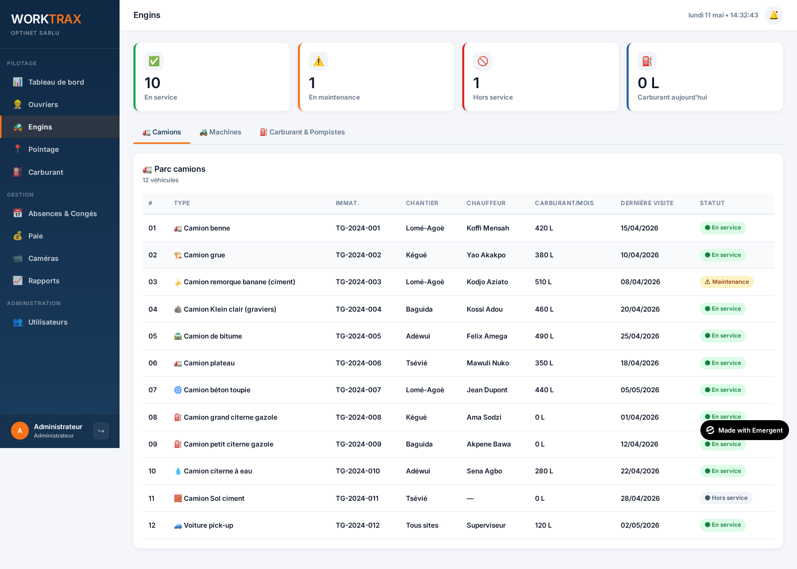

Chaque camion affiche : numéro, type (Camion benne, grue, citerne gazole, citerne eau, pick-up...), immatriculation, chantier, chauffeur, consommation/mois, dernière visite, statut (En service / Maintenance / Hors service).

### Onglet 🚜 Machines (16 engins)

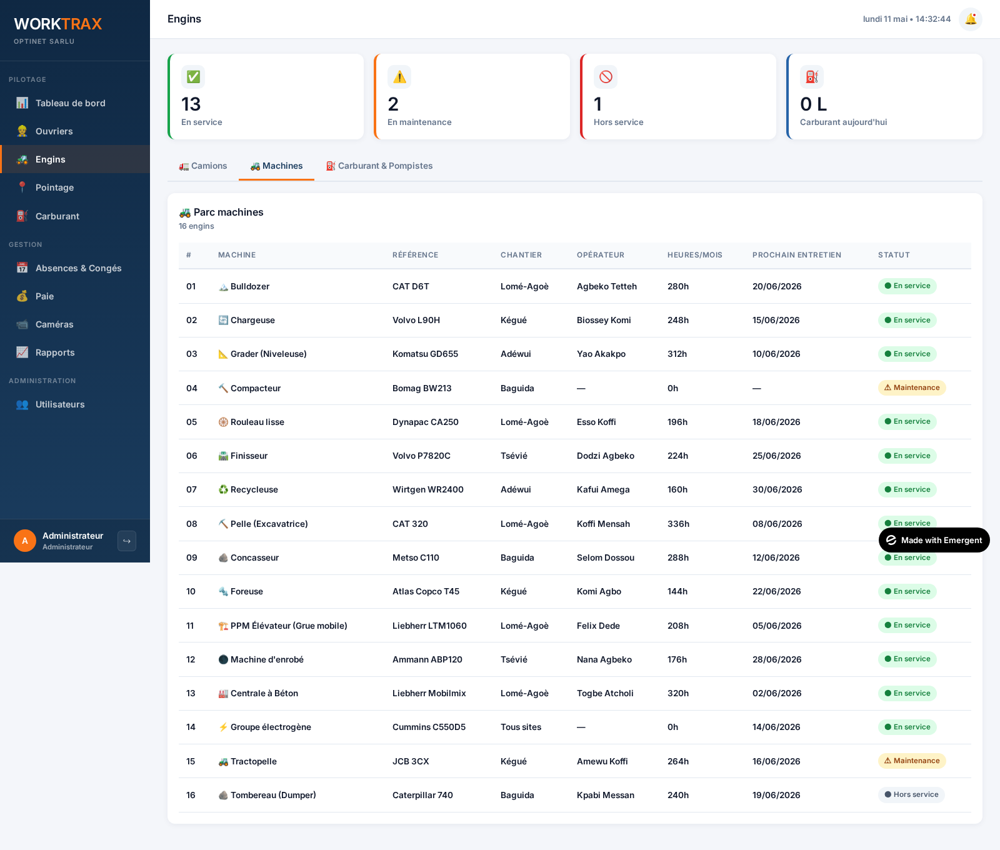

Liste des machines avec : référence (CAT D6T, Volvo L90H, Komatsu GD655...), opérateur, heures/mois, prochain entretien, statut.

### Onglet ⛽ Carburant & Pompistes

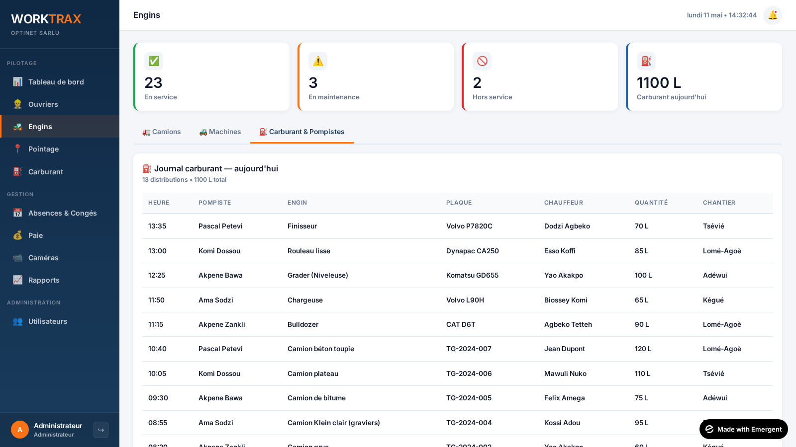

Journal des distributions de carburant du jour : heure, pompiste, engin, plaque, chauffeur, quantité (L), chantier.

---

## 8. Pointage biométrique automatique

### Page Pointage (Administrateur / Superviseur)

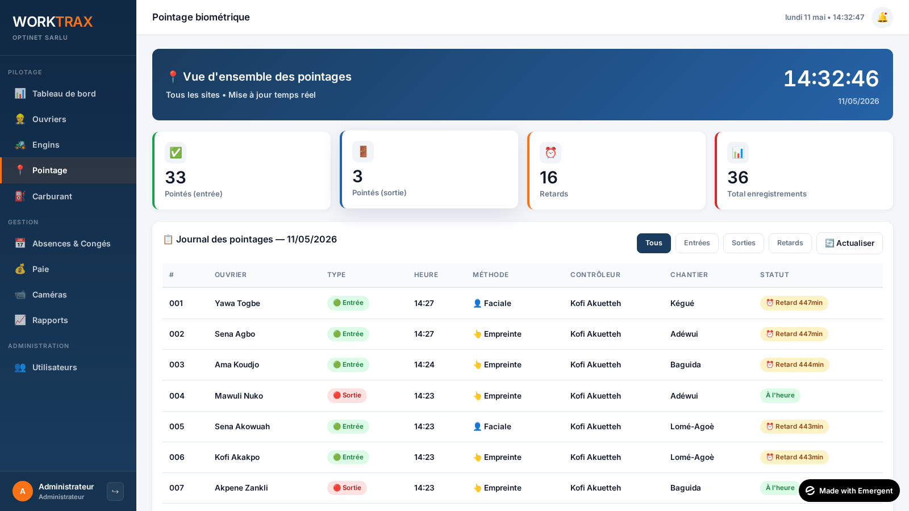

Cette page affiche tous les pointages du jour avec filtres : Tous / Entrées / Sorties / Retards. Chaque ligne montre l'ouvrier, le type, l'heure, la méthode utilisée (empreinte ou faciale), le contrôleur, le chantier et le statut (à l'heure / retard).

### Terminal Contrôleur (sur tablette terrain)

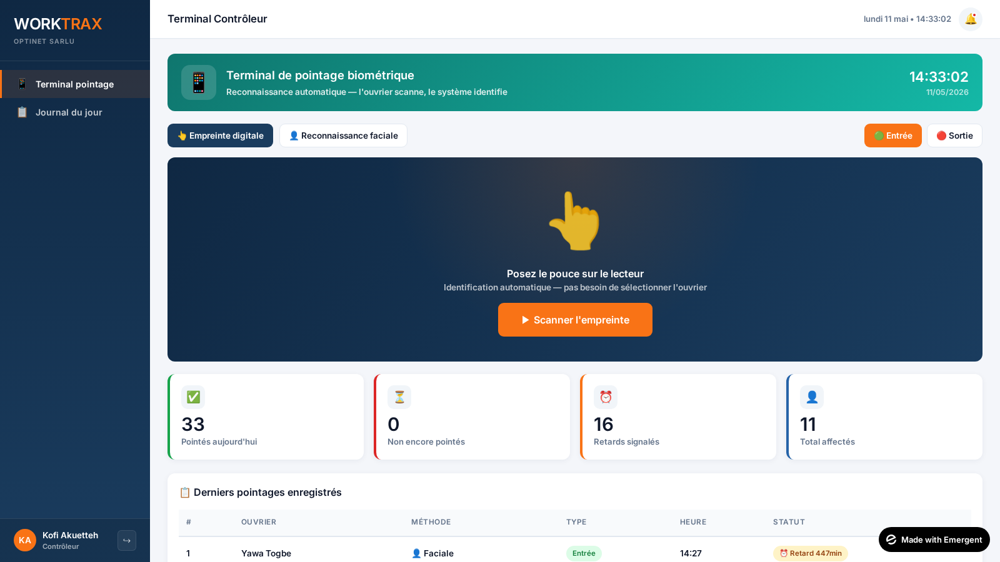

**Reconnaissance automatique** — Pas besoin de sélectionner l'ouvrier !

**Workflow :**

1. Choisir le mode : **👆 Empreinte digitale** ou **👤 Reconnaissance faciale**
2. Choisir le type de pointage : **🟢 Entrée** ou **🔴 Sortie**
3. L'ouvrier pose son doigt (ou présente son visage face à la webcam)
4. Cliquer **▶ Scanner l'empreinte / Scanner le visage**
5. Le système identifie automatiquement l'ouvrier en 1-2 secondes

> 🛡️ **Protection anti-double-clic** : le bouton est désactivé pendant le scan + cooldown de 2 secondes après chaque scan.

### Résultat de reconnaissance

Si l'ouvrier **n'est pas reconnu** (ou s'il a déjà pointé), une alerte rouge avec **bip sonore d'alarme** s'affiche :

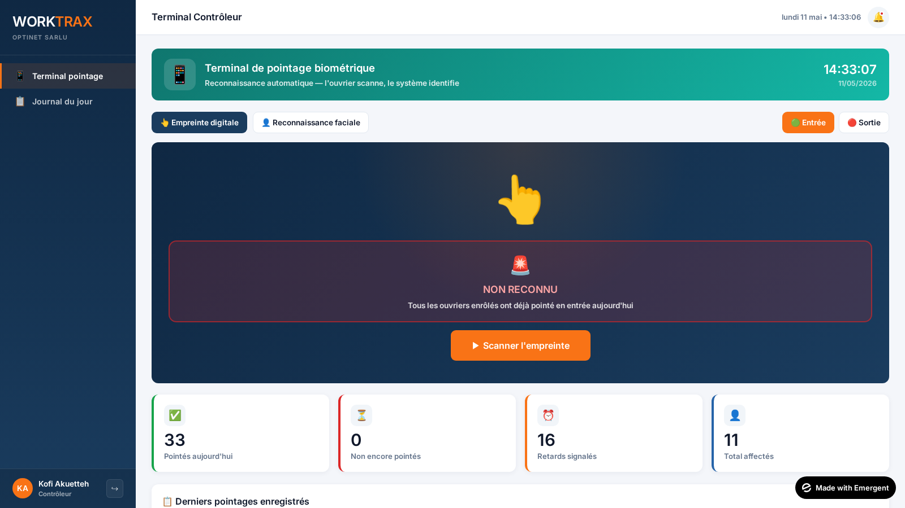

Si la reconnaissance réussit, un bandeau vert avec le nom, l'avatar et l'heure s'affiche + **bip aigu de succès**.

---

## 9. Terminal Pompiste

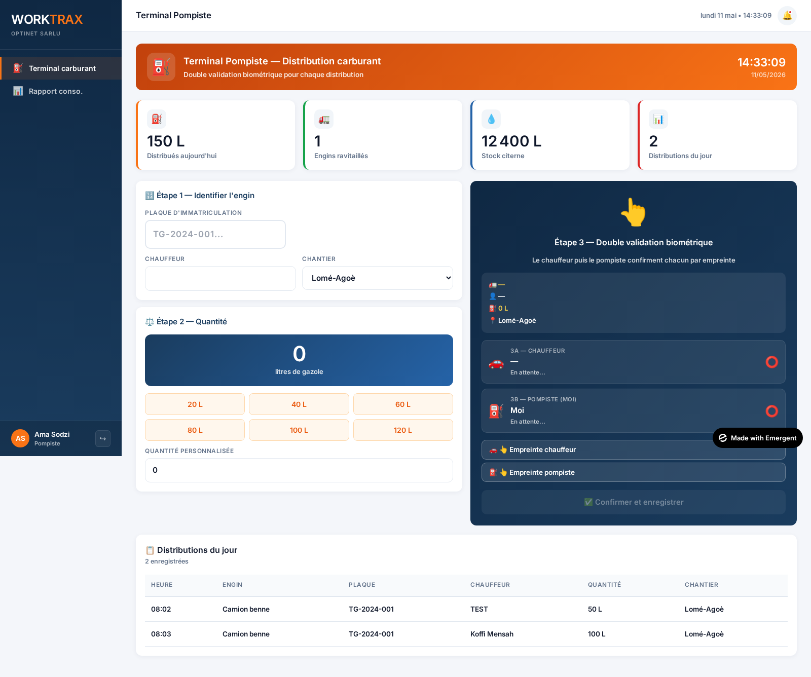

Distribution carburant en **3 étapes** avec **double validation biométrique**.

### Étape 1 — Identifier l'engin
- Taper la plaque (ex: **TG-2024-001**) — suggestions automatiques
- Le système affiche le nom de l'engin, le chauffeur affecté et le chantier

### Étape 2 — Quantité
- Choisir parmi les presets (20, 40, 60, 80, 100, 120 L)
- Ou saisir une quantité personnalisée
- L'affichage montre en grand : **80 litres de gazole**

### Étape 3 — Double validation biométrique

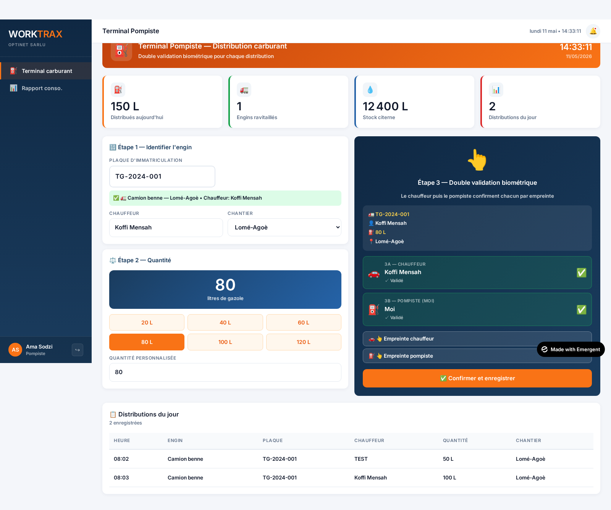

1. Le **chauffeur** valide son empreinte 👆 (3a)
2. Le **pompiste** valide son empreinte 👆 (3b)
3. Cliquer **✅ Confirmer et enregistrer** pour finaliser

> 🔒 La double validation empêche toute fraude. La distribution est tracée avec date, heure, GPS du site.

Les KPI en haut montrent : total litres distribués aujourd'hui, engins ravitaillés, stock citerne, nombre de distributions.

---

## 10. Espace RH

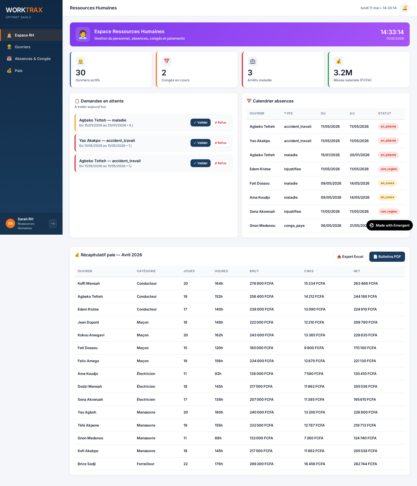

L'espace RH offre une vue complète sur :

### KPI
- 👷 Ouvriers actifs
- 📅 Congés en cours
- 🏥 Arrêts maladie
- 💰 Masse salariale du mois

### Sections
- **📋 Demandes en attente** : congés à valider/refuser
- **📅 Calendrier absences** : toutes les absences en cours
- **💰 Récapitulatif paie** : bulletins du mois avec export Excel / impression PDF

### Page Absences & Congés détaillée

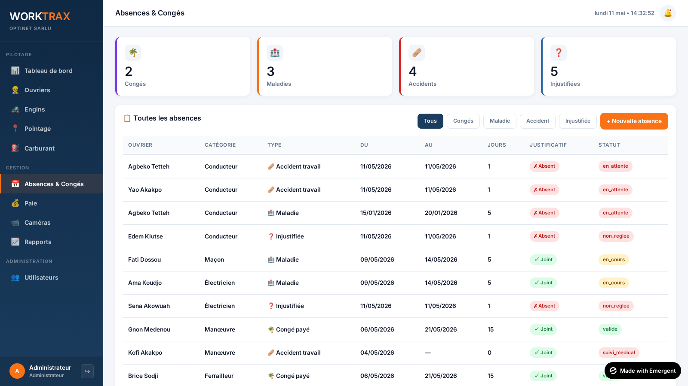

4 types d'absences gérés :
- 🌴 **Congé payé**
- 🏥 **Maladie**
- 🩹 **Accident travail**
- ❓ **Injustifiée**

Bouton **+ Nouvelle absence** pour déclarer (admin, RH, superviseur). L'absence est liée à un ouvrier et synchronise automatiquement son statut.

### Page Paie

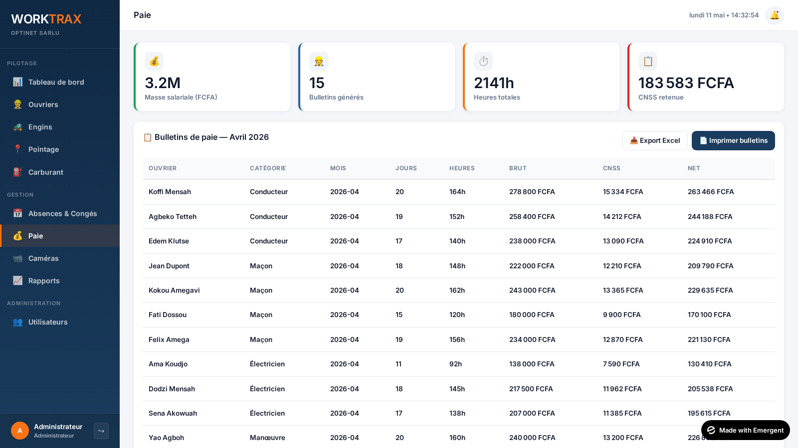

Bulletins mensuels avec : ouvrier, catégorie, jours travaillés, heures, montant brut, retenue CNSS (5,5 %), net à payer. Export Excel et impression PDF disponibles.

---

## 11. Espace Superviseur

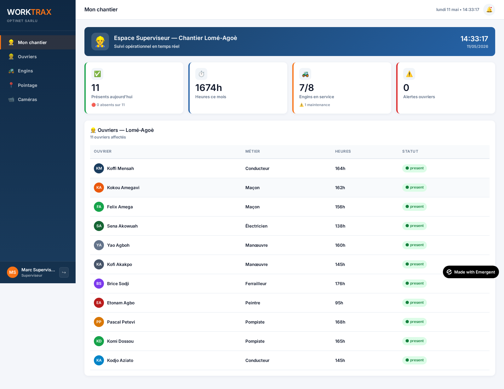

Le superviseur ne voit **que les données de son chantier** (ex: Lomé-Agoè). Il dispose de :

- ✅ KPI temps réel : présents, heures, engins en service, alertes
- 👷 **Liste des ouvriers affectés** au chantier avec leur statut

> 💡 Le superviseur peut aussi accéder aux modules **Ouvriers**, **Engins**, **Pointage**, **Caméras** filtrés sur son site.

---

## 12. Caméras IP

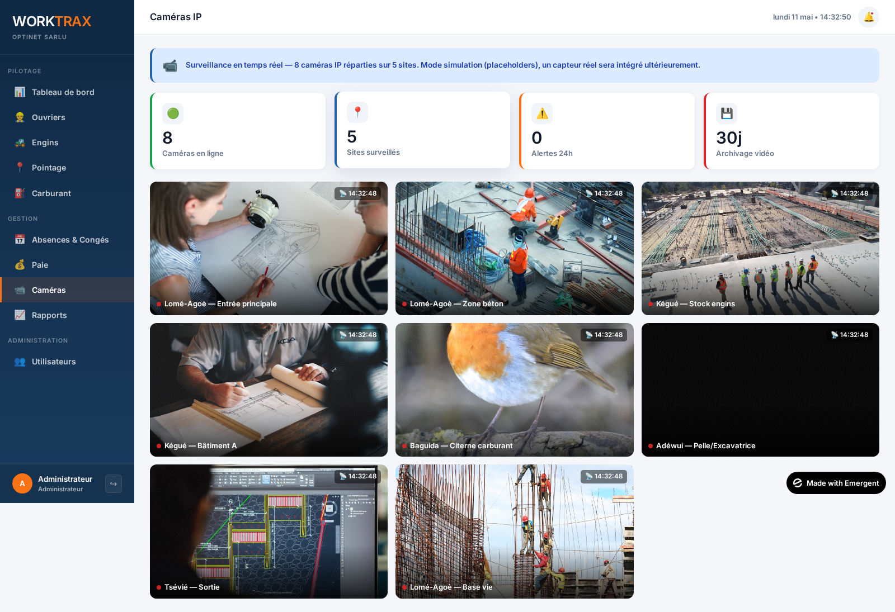

8 caméras IP réparties sur les 5 sites avec :
- Indicateur **🔴 LIVE** clignotant
- Horodatage en direct
- Zones surveillées (Entrée principale, Zone béton, Stock engins, Bâtiment A, Citerne carburant, Pelle/Excavatrice, Sortie, Base vie)

KPI : caméras en ligne, sites surveillés, alertes 24h, durée d'archivage (30 jours).

> 📹 En production, des flux RTSP réels (Hikvision, Dahua, Axis) sont intégrés via WebRTC.

---

## 13. Rapports & Statistiques

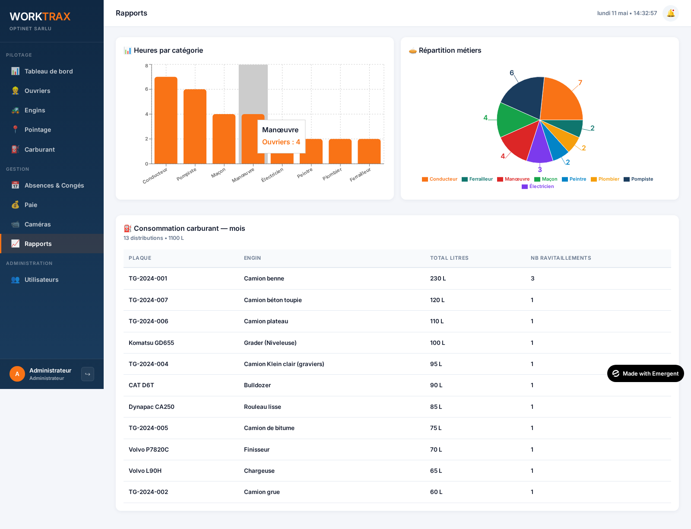

Page de rapports avec :
- 📊 **Heures par catégorie** : barres verticales
- 🥧 **Répartition métiers** : camembert
- ⛽ **Consommation carburant** mensuelle par engin (avec total et nombre de ravitaillements)

> 📥 Tous les rapports sont exportables en CSV/Excel/PDF.

---

## 14. Gestion des utilisateurs

> 🔒 Réservé à l'**Administrateur**.

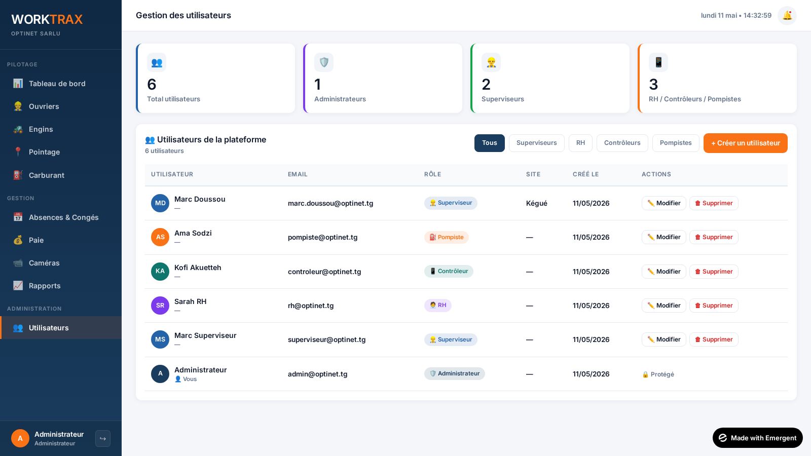

L'admin peut créer **plusieurs utilisateurs** par rôle :
- Plusieurs Superviseurs (un par chantier)
- Plusieurs RH
- Plusieurs Contrôleurs (un par tablette terrain)
- Plusieurs Pompistes (un par citerne / dépôt)

### KPI utilisateurs
- 👥 Total
- 🛡️ Administrateurs (1 seul, protégé)
- 👷‍♂️ Superviseurs
- 📱 RH / Contrôleurs / Pompistes

### Création d'utilisateur

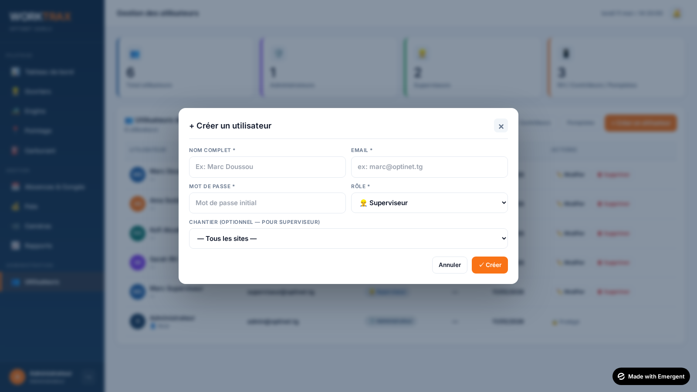

Formulaire avec : nom complet, email, mot de passe initial, rôle (Superviseur, RH, Contrôleur, Pompiste — **PAS admin** pour sécurité), chantier affecté (optionnel, pour superviseur).

### Actions disponibles
- ✏️ **Modifier** : nom, mot de passe, rôle, chantier
- 🗑️ **Supprimer** : sauf admin et soi-même (protection)

> ⚠️ Le compte **Administrateur** est protégé : on ne peut ni le modifier ni le supprimer via l'interface.

---

## 15. Sécurité et conformité

WORKTRAX intègre les meilleures pratiques de sécurité :

- 🔐 **Authentification JWT** (jetons signés, valides 12h)
- 🔑 **Mots de passe hashés** avec bcrypt (salage automatique)
- 🛡️ **RBAC strict** : chaque endpoint vérifie le rôle de l'utilisateur
- 🚫 **Protection anti-fraude** : double validation biométrique pour le carburant
- 🚫 **Protection anti-double-clic** : verrouillage logique + cooldown de 2 s
- 🔊 **Alerte sonore + visuelle** en cas de non-reconnaissance
- 📡 **HTTPS** obligatoire en production
- 💾 **Archivage** : pointages + vidéos conservés 30 jours minimum

### Conformité Togo
- ✅ Loi sur la protection des données personnelles
- ✅ Conformité CNSS pour les bulletins de paie
- ✅ Traçabilité complète pour audits clients

---

## 16. FAQ & Dépannage

### Q1 — Je ne peux pas me connecter
1. Vérifiez l'email (pas d'espace, en minuscules)
2. Cliquez sur 👁 **Voir** pour vérifier le mot de passe
3. Sélectionnez le bon rôle dans la liste déroulante
4. Si le problème persiste, contactez l'administrateur

### Q2 — Le scanner ne reconnaît pas l'ouvrier
- Vérifier que l'ouvrier a bien été **enrôlé** (visage ou empreinte) dans le module Ouvriers
- L'ouvrier a peut-être déjà pointé pour la session en cours (entrée du jour, sortie du jour)
- Si "Aucun ouvrier enrôlé", refaire l'enrôlement via **+ Ajouter ouvrier**

### Q3 — Comment ajouter un nouveau chantier ?
Pour l'instant, les 5 chantiers sont fixes (Lomé-Agoè, Kégué, Baguida, Adéwui, Tsévié). Pour ajouter un site, contactez l'équipe de développement.

### Q4 — Comment exporter en PDF ?
Les boutons **📥 Export Excel** et **📄 PDF** sont présents sur les pages Paie, Absences, Rapports.

### Q5 — La webcam ne s'active pas
- Autoriser l'accès à la webcam dans les paramètres du navigateur
- Vérifier que le navigateur est sur **HTTPS** (Chrome refuse la webcam en HTTP)
- Tester sur Chrome ou Edge (Safari peut bloquer)

### Q6 — Comment changer le mot de passe d'un utilisateur ?
**Admin** : Page **👥 Utilisateurs → ✏️ Modifier** sur l'utilisateur → remplir le champ Mot de passe.

### Q7 — Qui peut créer des utilisateurs ?
Seul l'**Administrateur**. Et seuls 4 rôles peuvent être créés (Superviseur, RH, Contrôleur, Pompiste). On ne peut pas créer un second admin via l'interface (sécurité).

---

## 📞 Support

**OPTINET SARLU**
- 📞 +228 90 74 84 65 / +228 99 05 84 71
- 📧 optinetsarl@gmail.com
- 🌐 www.optinet.tg
- 📍 Lomé-Agoè Cacavéli, derrière la CEET, Togo

---

*© 2026 OPTINET SARLU — Document confidentiel — Diffusion restreinte*
